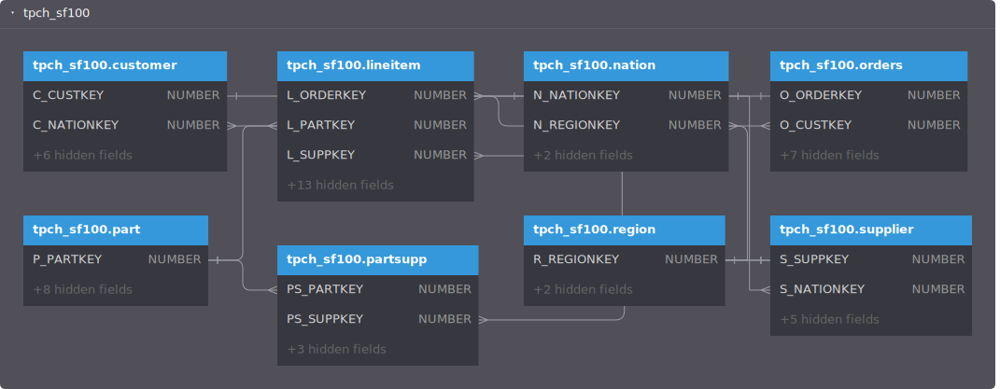
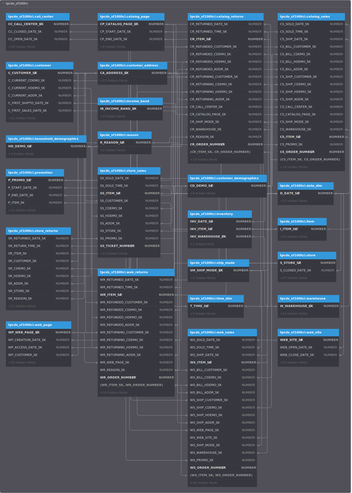

# Snowflake DBML Generator

The Snowflake DBML Generator is an open-source tool for easily transforming Snowflake database schemas into [DBML (Database Markup Language)](https://dbml.dbdiagram.io/home/). It enables quick visualization and documentation of database structures. These diagrams can be uploaded to tool such as [dbdiagram.io](https://dbdiagram.io/) or [dbdocs.io](https://dbdocs.io/) for quick visualization. 

Ideal for data engineers, analysts, and ML engineers, this tool simplifies the creation of ER diagrams and helps maintain clear, accurate database documentation—streamlining database management and collaboration.

## Quick Start

```bash
pip install snowflake-dbml-generator
snowflake-dbml --interactive
```

## Examples

The following examples demonstrate the Snowflake DBML Generator in action using Snowflake the [Sample Data Sets](https://docs.snowflake.com/en/user-guide/sample-data) in Snowflake.

### 1. Sample TPCH SF100 Dataset

* View on dbdiagram.io: [ER Diagram : TPCH SF100](https://dbdiagram.io/d/snowflake_sample-TPCH_SF100-6631d8395b24a634d03a1d8e)
* Dataset docs in Snowflake: [Docs: Sample TPCH SF100](https://docs.snowflake.com/en/user-guide/sample-data-tpch.html)

[](https://dbdiagram.io/d/snowflake_sample-TPCH_SF100-6631d8395b24a634d03a1d8e)

### 2. Sample TPCDS SF100TCL Dataset

* View on dbdiagram.io: [ER Diagram: TPCH SF1](https://dbdiagram.io/d/snowflake_sample-tpcds_sf100tcl-6631078d5b24a634d02fbd57)
* Dataset docs in Snowflake: [Docs: Sample TPCDS SF100TCL](https://docs.snowflake.com/en/user-guide/sample-data-tpcds.html)

[](https://dbdiagram.io/d/snowflake_sample-tpcds_sf100tcl-6631078d5b24a634d02fbd57)

## Features

- **Automatic DBML Generation**: Convert Snowflake schema definitions directly into DBML.
- **Support for Complex Schemas**: Handles complex relationships, including composite foreign keys.
- **Interactive Mode**: Offers an interactive mode for generating configuration files and setting up database connections.
- **Customizable Visualization**: Customize the appearance of generated DBML files with configurable color schemes for different types of tables.
- **SQL Comments Extraction**: Extract SQL table and column comments and convert them into DBML notes, enhancing the documentation within the generated DBML.
- **Table Statistics**: Extract and include table statistics such as row count and size in bytes as part of the table notes in the DBML, providing a quick reference to the table's scale and usage.


## Installation

### Prerequisites

- Python 3.6 or higher
- Snowflake account credentials

### Install from PyPI

You can install the Snowflake DBML Generator directly using pip:

```bash
pip install snowflake-dbml-generator
```

### Build from Source

To build from source, clone the repository and install the package:

```bash
git clone https://github.com/ryanrozich/snowflake-dbml-generator.git
cd snowflake-dbml-generator
pip install -e .
```

## Usage

### Command Line Interface

Once installed, you can run the generator using the command line:

```bash
snowflake-dbml --user <username> --password <password> --account <account_id> --warehouse <warehouse> --database <database> --role <role>
```

All the configuration parameters mentioned above can also be set using environment variables. This provides flexibility in how you configure the generator, especially useful in different execution environments. For detailed information on all available configuration parameters and how to set them, refer to the section on [Configuration Parameters](#configuration-parameters).

### Interactive Mode

For a guided setup, run the generator in interactive mode:

```bash
snowflake-dbml --interactive
```

This mode will guide you through setting up your connection and configuration settings and optionally save them to a `.env` file for future use.

## Configuration Parameters

The Snowflake DBML Generator can be configured using environment variables, a `.env` file, or command-line arguments. The configuration follows an order of precedence:

1. **Command-Line Arguments**: Parameters provided via command line have the highest priority and override any set in the `.env` file or environment variables.
2. **.env File**: Located in the root directory, this file can override environment variables but is overridden by command-line arguments. (sample file: [.env.sample](.env.sample))
3. **Environment Variables**: If neither command-line arguments nor a `.env` file are used, the application will default to environment variables.

### Configuration Options

Below is a table listing the available configuration parameters, their corresponding environment variable names, and the command-line options. Optional parameters are marked with an asterisk (*).

| Environment Variable     | Description                                          | Command-Line Argument                 |
|--------------------------|------------------------------------------------------|---------------------------------------|
| `SNOWFLAKE_USER`         | Your Snowflake user name.                            | `--user <snowflake-username>`         |
| `SNOWFLAKE_PASSWORD`     | Your Snowflake password.                             | `--password <snowflake-password>`     |
| `SNOWFLAKE_ACCOUNT`      | Your Snowflake account identifier. See [Snowflake documentation](https://docs.snowflake.com/en/user-guide/admin-account-identifier.html#non-vps-account-locator-formats-by-cloud-platform-and-region) for how to find your account id.                   | `--account <snowflake-account>`       |
| `SNOWFLAKE_WAREHOUSE`    | Your Snowflake warehouse. | `--warehouse <snowflake-warehouse>`   |
| `SNOWFLAKE_DATABASE`     | Your Snowflake database name.                        | `--database <snowflake-database>`     |
| `SNOWFLAKE_ROLE`         | Your Snowflake role.                                 | `--role <snowflake-role>`             |
| `INCLUDED_SCHEMAS`*      | Comma-separated list of schemas to include.          | `--included-schemas <schema-list>`    |
| `EXCLUDED_SCHEMAS`*      | Comma-separated list of schemas to exclude.          | `--excluded-schemas <schema-list>`    |
| `TABLE_COLOR`*           | Color for table headers in DBML.                     | `--table-color <color>`               |
| `VIEW_COLOR`*            | Color for view headers in DBML.                      | `--view-color <color>`                |
| `DYNAMIC_TABLE_COLOR`*   | Color for dynamic table headers in DBML.             | `--dynamic-table-color <color>`       |
| `CONFIG_FILE`*           | Path to the config JSON file with primary/foreign key hints. | `--config-file <path-to-config>` |

### Interactive Configuration

If no configurations are provided through the above methods, the application will enter an interactive mode, guiding the user to set up the necessary parameters interactively. At the end of this session, users will have the option to save their settings to a `.env` file in the current directory for future use.

### Command Line Help

To view all available command-line options and their descriptions, you can use the help command:

```bash
snowflake-dbml --help
```

## Configuration File

For configurations involving primary key and foreign key relationships, the Snowflake DBML Generator extracts these relationships directly from Snowflake's metadata and creates corresponding DBML keys and relationships. However, since Snowflake does not enforce referential integrity, many Snowflake databases do not include explicit primary and foreign key declarations in their DDL. To address databases lacking these declarations, you can use a `config.json` file. This configuration file allows you to specify rules for inferring relationships, ensuring your generated DBML reflects the intended schema relationships accurately, even when they are not explicitly defined in Snowflake.

An example configuration file named `config.json.sample` is included in the repository, which can be used as a template for creating your custom configuration file. [View the sample file](config.json.sample).

#### Configuration JSON Structure

```json
{
    "table-primary-keys": {
        "schema1.dim_table1": {
            "natural_key": ["entity1_name"],
            "primary_key": {
                "column": "ID",
                "reference_as": ["entity1_ID"]
            }
        },
        "schema2.dim_table2": {
            "natural_key": ["entity2_name", "other_id"],
            "primary_key": {
                "column": "ID",
                "reference_as": ["entity2_ID"]
            }
        },
        "schema1.dim_table3": {
            "natural_key": ["entity3_name"]
        }
    }
}
```

#### Key Definitions

- **`table-primary-keys`**: A dictionary where each key is a fully qualified table name (`schema.table`) and each value is an object defining keys for that table.
- **`natural_key`**: An array of column names that together form a composite key. If another table contains all of these columns, a foreign key relationship will be generated in the DBML.
- **`primary_key`**: An object specifying a column in the table that acts as a primary key:
  - **`column`**: The name of the primary key column.
  - **`reference_as`**: An array of column names in other tables that should be treated as foreign keys referencing this primary key.

#### Relationship Inference

- **Natural Key**: When a `natural_key` is defined, any table containing all specified columns will have a foreign key relationship created pointing to the table where the `natural_key` is defined.
- **Primary Key**: For a `primary_key`, if other tables contain any columns listed in `reference_as`, a foreign key relationship is created between that column and the primary key column in the defined table. This helps in situations where column names are not identical across tables but should still reference each other (e.g., `customer.id` = `order.customer_id`).

This configuration approach provides a flexible way to ensure that your generated DBML accurately reflects the intended database schema relationships, especially in environments where referential integrity is crucial but not enforced by the database system itself.

### Generating DBML

To generate a DBML file, create an `.env` file with your Snowflake credentials and configuration parameters and (optionally) a config.json file with your primary and foreign key hints. 

Then run the following command to generate the DBML output file:

```bash
snowflake-dbml --config-file config.json > output.dbml
```

## Contributing

Contributions are welcome! Feel free to open an issue or pull request on our [GitHub repository](https://github.com/ryanrozich/snowflake-dbml-generator).

## License

This project is licensed under the MIT License - see the [LICENSE](LICENSE) file for details.

## Author

Ryan Rozich - Feel free to contact me on [GitHub](https://github.com/ryanrozich).

## Acknowledgments

